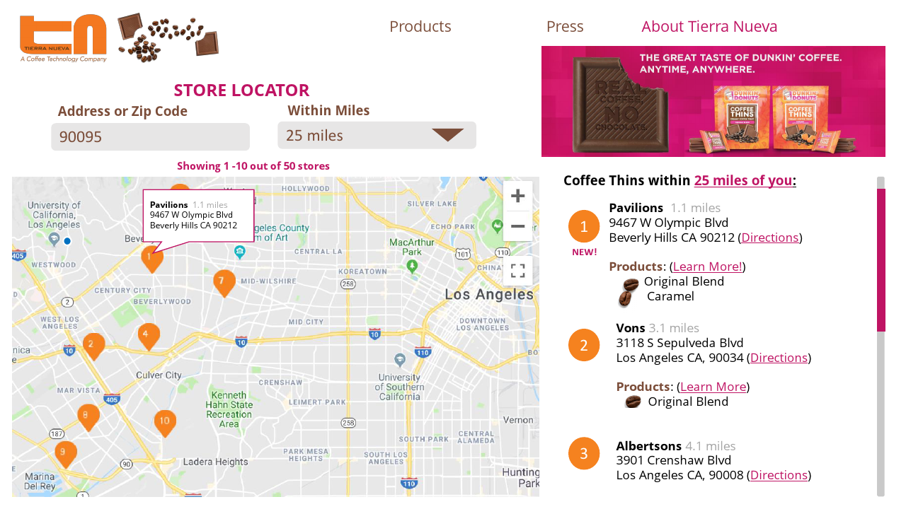

# Project-01 TIERRA NUEVA – Whole Coffee – Coffee Thins: Store Locator Landing Page
Link to Live Application: [Coffee Thins Store Locator](https://corejola.github.io/CoffeeThin-StoreLocator/)

## Team:
    Lorraine Baynosa (Github: lorrainebaynosa)
    Ben Kha (Github: Benk0033)
    Nancy Hinojos (Github: NanceCA)
    Cedric Orejola (Github: corejola)

## APIs Utilized:
1. Velvet Branding Store Locator API
2. [Google Maps/Places API](https://developers.google.com/maps/documentation/)
3. [Firebase](https://firebase.google.com/)

## Libraries/Frameworks Utilized:
1. [Jquery](https://jquery.com/)
2. [lodash JS](https://lodash.com/)
3. [Materialze CSS Framework](https://materializecss.com/)
4. [Google Fonts](https://fonts.google.com/)

### Project Files: Google Drive Project Documentation
https://drive.google.com/open?id=1cSFDF5N4XBpez4A6QRmcaN52cYrMtT_k

For Frontend & Backend Pseudo Code

### Wire Frame:

### Usage:
1. Upon loading of the Tierra Nueva Coffee Thins Locator landing page, the page will prompt the user to request current location. The map will center on the user's current location.
2. User inputs the address or zip code in which they want to search. 
3. User inputs the range of miles to perform search.
4. Site will provide list of Retailers, within the mileage range that carry Tierra Nueva Coffee thins.
5. List from the Retailers will provide the Retailer Name, Retailer Address, Products carried at location, Miles away & link to directions based on search parameters.
6. Google Maps side map will provide markers for each store location, numbered to correlate to the list.

### Future Enhancements:
1. On page load, geolocated location through the browser triggers the search automatically.
2. Store the last address/geocode searches so that the user can change the mileage parameter without reentering the location
3. Site design update to incorporate product images in the search.
4. Re-query the search results based on the zoom of the map and the visible boundaries. Allowing the user to drag the map to find more stores. (similar to Yelp).

### Support:
For issues or concerns regarding the Project-01 TIERRA NUEVA – Whole Coffee – Coffee Thins: Store Locator Landing Page, please reach out to Cedric Orejola via Github @ corejola.

### Contributing:
Pull requests are welcome. For major changes, please open an issue first to discuss what you would like to change.

Please make sure to update tests as appropriate.
